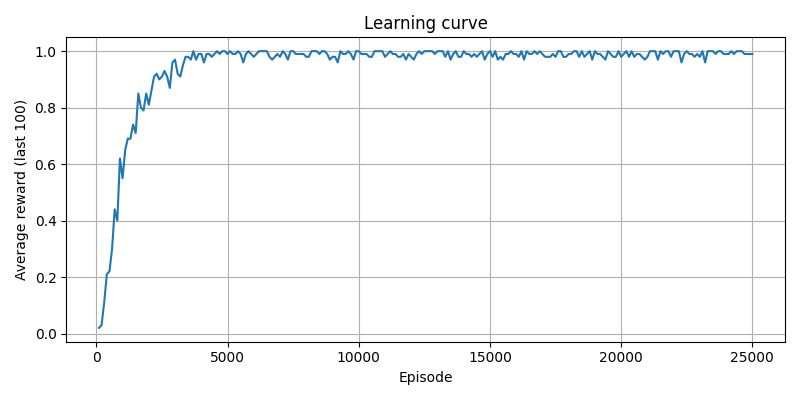
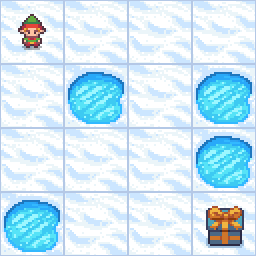

# Q-Learning on FrozenLake (Gymnasium)

This project implements **Q-Learning** to solve the classic **FrozenLake-v1** environment using [Gymnasium](https://gymnasium.farama.org/).

## 📊 Results

### Learning Curve
The agent’s reward over episodes:



### Learned Policy (Q-Table)
The Q-values for each state-action pair are saved in:
- `data/q_table.npy` (binary NumPy format)
- `data/q_table.csv` (human-readable)

### Training Animation
The agent navigating the FrozenLake environment:



---

## 📁 Files
- `q_learning.py` → main training script  
- `data/q_table.npy` → learned Q-table  
- `data/history.json` → training rewards history  
- `data/learning_curve.png` → learning curve plot  
- `data/recording.gif` → environment animation  

---

## ⚙️ Installation
```bash
git clone https://github.com/ariankhanjani/q_learning_frozenlake.git
cd q_learning_frozenlake
pip install -r requirements.txt

